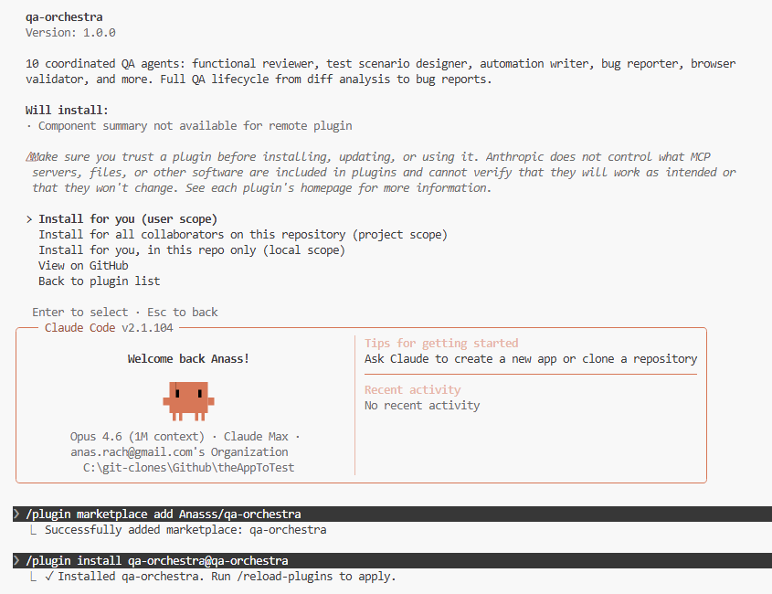

# QA Orchestra

**10 standalone QA agents for [Claude Code](https://docs.anthropic.com/en/docs/claude-code).** Each one answers a specific question about your PR — *does this diff implement the AC?*, *what scenarios do I need?*, *which of my tests will break?* — and writes a Markdown report you can paste into GitHub or Jira.

**Two layers**: the agents bring QA expertise (diff vs AC analysis, scenario design, test selection). MCP brings the data (GitHub, Chrome DevTools, Jira, GitLab). Your `context/CONTEXT.md` describes your stack in one file.

No SaaS. No API keys beyond Claude. Works with **any stack**.



---

## Install

### Option A: Plugin install (recommended)

In any Claude Code chat, run:

```
/plugin marketplace add Anasss/qa-orchestra
/plugin install qa-orchestra@qa-orchestra
/reload-plugins
```

Or use the UI: Customize → **Manage plugins** → **Marketplaces** tab → paste `Anasss/qa-orchestra` → Add → **Plugins** tab → Install.

Once installed, all 10 agents are available. Type `@functional-reviewer`, `@orchestrator`, etc.

<details>
<summary>What the install looks like in Claude Code</summary>



</details>

### Option B: Global agents (available in all projects)

```bash
# Clone and copy agents to your global directory
git clone https://github.com/Anasss/qa-orchestra.git
cp qa-orchestra/.claude/agents/*.md ~/.claude/agents/
```

### Option C: Clone into your workspace

```bash
# 1. Clone alongside your project repos
git clone https://github.com/Anasss/qa-orchestra.git
cd qa-orchestra

# 2. Fill in your project context
cp examples/CONTEXT.example.md context/CONTEXT.md
# Edit context/CONTEXT.md with your stack, repos, URLs, and commands

# 3. Open Claude Code — agents auto-load from .claude/agents/
claude
```

## What It Does

Pick one agent for one question. **`@functional-reviewer` is the most common entry point**:

```
You: @functional-reviewer Compare PR #42 against these ACs:
     AC-1: users can add items to the cart from the product listing page
     AC-2: the cart count in the nav header updates immediately after adding

QA Orchestra writes qa-output/functional-review.md:
  - AC-1: COVERED at src/components/quick-add-button.tsx:43
  - AC-2: AT RISK — no router.refresh() after the server action
  - 2 regression risks in unchanged code paths touched by the diff
  - Verdict: GAPS — needs browser validation on AC-2
```

One agent. One question. One Markdown file you can paste into GitHub or Jira.

**Other standalone entry points**:

- `@test-scenario-designer` — generate test scenarios from acceptance criteria (happy, negative, boundary, edge)
- `@smart-test-selector` — map a diff to your existing tests; find what to run, what may break, and where coverage is missing
- `@bug-reporter` — turn findings into developer-ready bug reports

Each runs independently. None requires the orchestrator or a prior agent. For the full pipeline (`@orchestrator`), see the recipe table below — most users never need it.

Every agent writes to `qa-output/`. The next agent reads from there. No copy-pasting between agents.

**Not in scope**: code quality review, linting, security scanning, performance profiling, or unit-test generation. QA Orchestra is scoped to functional correctness against acceptance criteria.

## Agents

QA Orchestra ships **10 agents organized by how you'll actually use them.** Most users live in Tier 1. You can stop reading after the first table if you want — everything below it is optional.

### Tier 1 — Standalone use cases (start here)

These four agents are the daily drivers. Each answers one question, runs independently, and produces a Markdown file you can paste into GitHub, Jira, or Linear.

| Agent | Model | Answers the question |
|---|---|---|
| **functional-reviewer** | Opus | Does this diff actually implement the acceptance criteria? Where are the gaps and risks? |
| **test-scenario-designer** | Sonnet | What test scenarios do I need to cover this AC? Happy path, negative, boundary, edge. |
| **smart-test-selector** | Sonnet | Which of my existing tests does this diff affect? What's likely to break? Where are my coverage gaps? |
| **bug-reporter** | Sonnet | Turn these findings into developer-ready bug reports. |

### Tier 2 — Live validation chain

These two agents work together to test the feature in a real browser, not just read the diff. They're what separates QA Orchestra from static AI review tools.

| Agent | Model | What it does |
|---|---|---|
| **environment-manager** | Sonnet | Checks out the PR branch, starts the app locally, verifies end-to-end health before handing off |
| **browser-validator** | Sonnet | Navigates the running app via Chrome MCP, executes test scenarios, verifies expected results, and captures evidence |

**Requires**: Chrome DevTools MCP, a local dev environment, and a `context/CONTEXT.md` that describes how to start your app. See the [MCP Servers](#mcp-servers-optional) section.

### Tier 3 — Orchestration and supporting agents

You won't reach for these every day. They exist for the full-pipeline workflow and for more niche situations.

| Agent | Model | What it does |
|---|---|---|
| **orchestrator** | Sonnet | Routes a ticket through the full pipeline, deciding which agents to run and in what order |
| **release-analyzer** | Opus | Multi-repo release diff analysis — cross-repo impact, AC compliance gaps, and deployment risks |
| **automation-writer** | Sonnet | Converts test scenarios into runnable test code — Playwright, Cypress, Selenium, pytest, JUnit, or Gherkin — following your project's existing patterns |
| **manual-validator** | Sonnet | Guides manual test execution, tracks pass/fail, produces a validation report |

## Start here — pick a recipe

You landed here because you have a question. Find the row that matches and run the command. Each row is a complete, standalone invocation — nothing else to set up beyond `context/CONTEXT.md`.

| I want to... | Run |
|---|---|
| Review a PR for AC compliance | `@functional-reviewer Compare this diff against these ACs: ...` |
| Generate test scenarios from a ticket | `@test-scenario-designer Generate scenarios for these ACs: ...` |
| Find which of my existing tests a diff affects | `@smart-test-selector Which existing tests are affected by this diff?` |
| Turn findings into developer-ready bug reports | `@bug-reporter Read qa-output/functional-review.md and create bug reports` |
| Get test scenarios + runnable automation code | `@test-scenario-designer` then `@automation-writer` |
| Validate a feature live in a real browser | `@environment-manager` then `@browser-validator` |
| Analyze a release across multiple repos | `@release-analyzer Analyze the diff between v1.0 and HEAD across all repos` |
| Run the full end-to-end pipeline *(experimental)* | `@orchestrator Run full pipeline for PR #42` |

If your question isn't in the table, pick the Tier 1 agent whose description matches best and describe your task in plain English.

## Output Chaining

Each agent writes structured Markdown to `qa-output/`. The next agent reads from there.

```
qa-output/
├── plan.md                 ← Orchestrator
├── environment-status.md   ← Environment Manager
├── functional-review.md    ← Functional Reviewer
├── test-scenarios.md       ← Test Scenario Designer
├── browser-validation.md   ← Browser Validator
├── bug-reports.md          ← Bug Reporter
├── validation-report.md    ← Manual Validator
├── test-selection.md       ← Smart Test Selector
├── release-analysis.md     ← Release Analyzer
└── automation/             ← Automation Writer
    ├── feature.spec.ts
    └── pages/feature.page.ts
```

## MCP Servers (Optional)

QA Orchestra integrates with MCP servers for enhanced capabilities:

| Server | Purpose | Required? |
|---|---|---|
| **Chrome DevTools** | Browser validation — navigate, click, verify | For `@browser-validator` |
| **GitHub** | Read issues, PRs, diffs | For PR-based workflows |
| **Jira** | Read tickets and AC | If using Jira |
| **GitLab** | Read MRs and diffs | If using GitLab |

A template lives at `examples/mcp.example.json` — copy it to `.mcp.local.json` in your project root and fill in your tokens. `.mcp.local.json` is gitignored.

> **Don't double-configure.** If you've already installed the `chrome-devtools-mcp` or `github` plugins from Claude Code's official marketplace, do NOT also declare those servers in your own `.mcp.local.json` — Claude Code will log a "server skipped — same command/URL as already-configured" warning on startup, and one of the two declarations silently won't work. Keep each MCP server declared exactly once across your whole setup.

## Living Context

`context/CONTEXT.md` is the single source of truth for your stack. Every agent reads it.

**You don't need to be a developer to edit CONTEXT.md.** Your product owner can set AC format conventions, severity definitions, and terminology. Your QA lead can refine the review criteria. Your business analyst can document domain rules the agents should enforce. Every agent reads CONTEXT.md and adjusts its behavior accordingly — no code changes required. The expertise layer lives in Markdown, not in source files.

`context/annotations/` accumulates project-specific learnings across sessions — agents update these automatically so your QA context gets smarter over time.

## Contributing

PRs welcome. The agents live in `.claude/agents/` — each is a standalone Markdown file with YAML frontmatter. To add a new agent:

1. Create `.claude/agents/your-agent.md` with the frontmatter format
2. Add it to the agent map in `CLAUDE.md`
3. Update `AGENTS.md` if it has chaining dependencies
4. Submit a PR

## License

MIT
